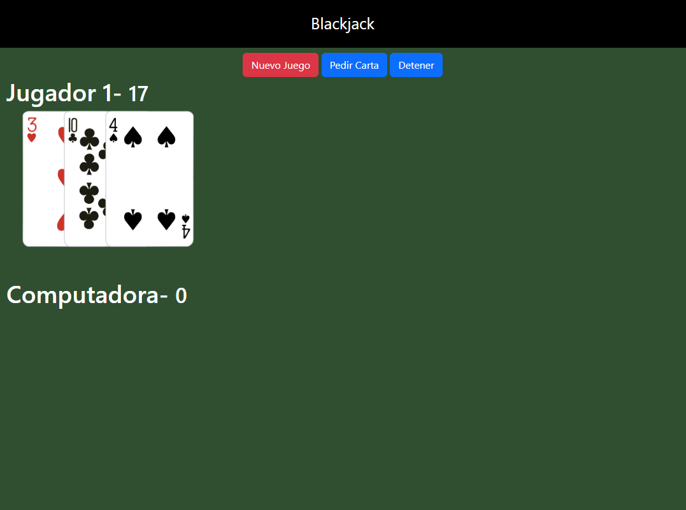
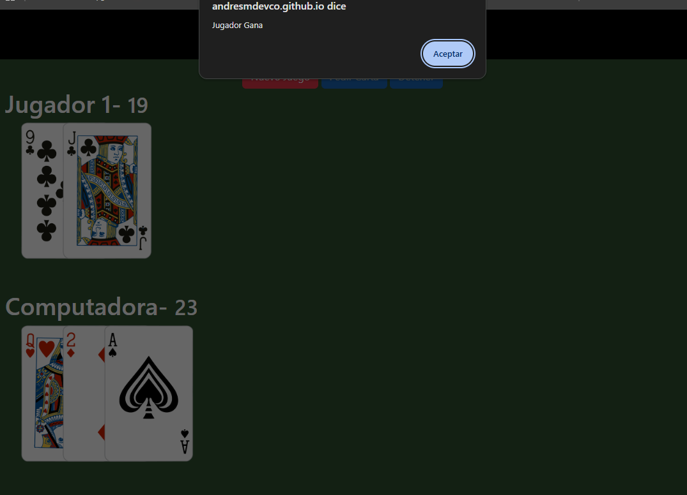
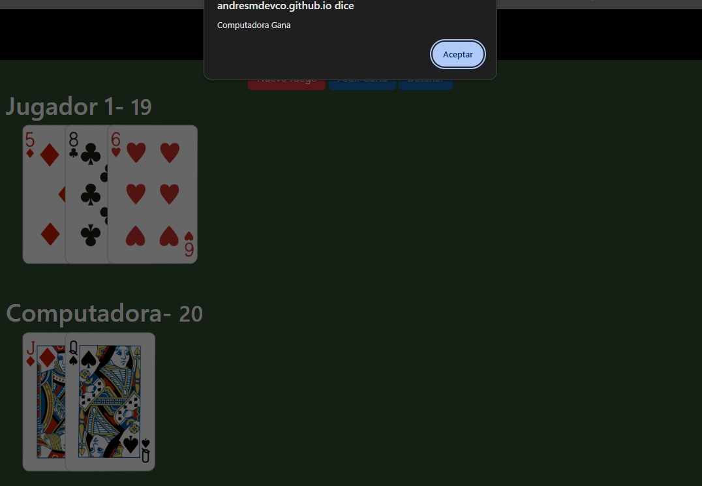

# ♠ Blackjack Game

Juego de Blackjack clásico desarrollado con JavaScript y Vite. Permite jugar contra la computadora con las reglas estándar del juego.

## 🚀 Demo 

👉 [Jugar Ahora](https://andresmdevco.github.io/blackjack-game-vite/)

### 📸 Capturas del juego

<p align="center">
  
  
  
</p>

## 🛠 Tecnologías


## Reglas del juego

- La baraja se compone de 52 cartas barajadas aleatoriamente al inicio de cada partida.
- El jugador puede pedir cartas o detenerse en cualquier momento.
- Si el jugador llega exactamente a 21 o se pasa, el turno de la computadora inicia automáticamente.
- Si la computadora supera 21, el jugador gana.
- Si el jugador supera 21, la computadora gana.
- Si ambos terminan con el mismo puntaje, nadie gana.

### Valor de las cartas
- **Numéricas (2–10):** su valor nominal.
- **Figuras (J, Q, K):** valen 10 puntos.
- **As (A):** vale siempre 11 puntos.

## ⚙️ Cómo ejecutar el proyecto

### 1. Clonar el repositorio

```bash
git clone https://github.com/andresmdevco/blackjack-game-vite.git
cd blackjack-game-vite
```

### 2. Instalar dependencias

```bash
npm install
```

### 3. Iniciar el servidor de desarrollo

```bash
npm run dev
```

### 4. Abrir la aplicación

Abre la URL de **localhost** que aparece en la terminal.
